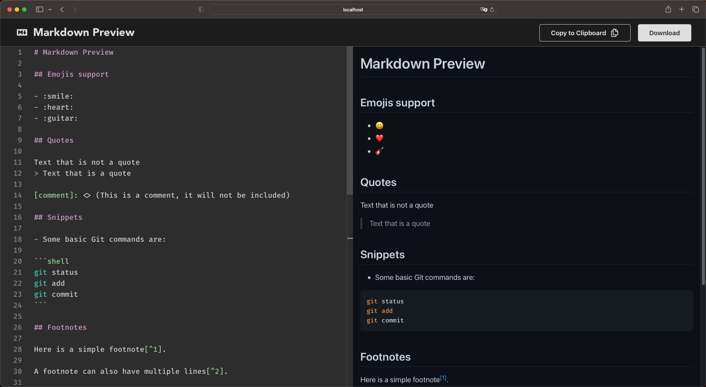

<h1 align="center">Markdown Preview</h1>

## Features

- **Github style:** The markdown content is rendered as close to the way it's rendered on GitHub as possible.
- **Code snippets:** Add code snippets with syntax highlight.
- **Emojis:** :heart: Displays emoji, such as `:smile:`. Take a look at the [Emoji Cheat Sheet](https://www.webfx.com/tools/emoji-cheat-sheet/) for a list of available emoji.
- **Copy to clipboard:** Option to copy the markdown content to clipboard.
- **Download:** Option to download the markdown content as a `.md` file.
- **Checklists:** Renders GitHub-style checklists.
- **Search in page:** Search within your markdown text and scroll to the results. Just hit `Ctrl+F` or `Cmd+F` on macOS.

# 
